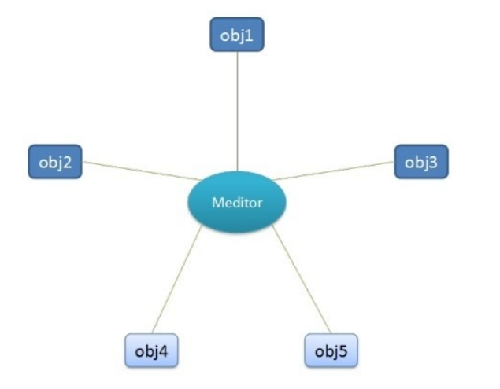
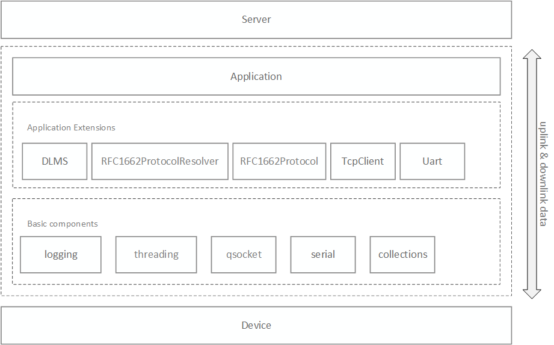
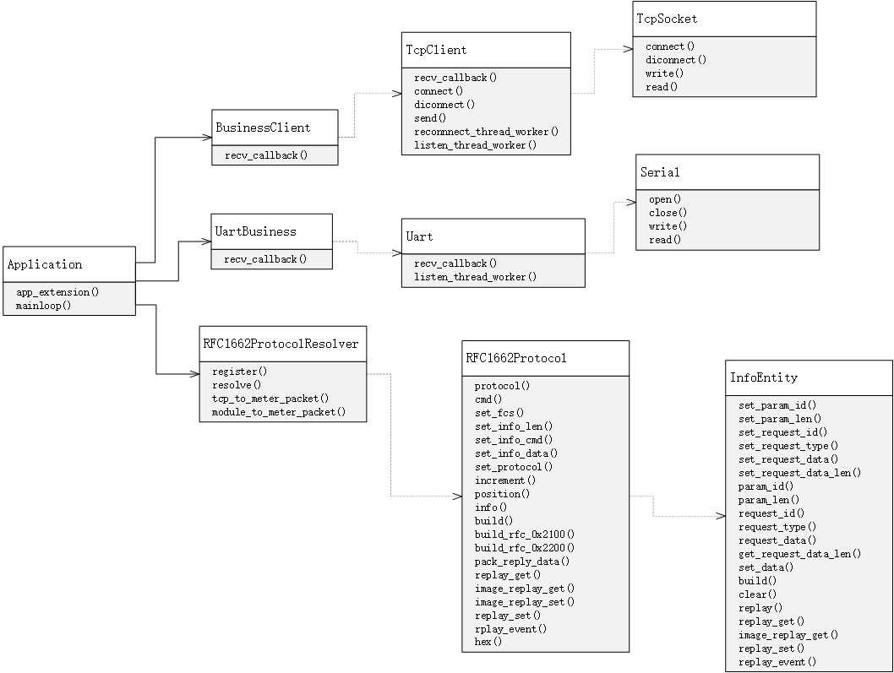
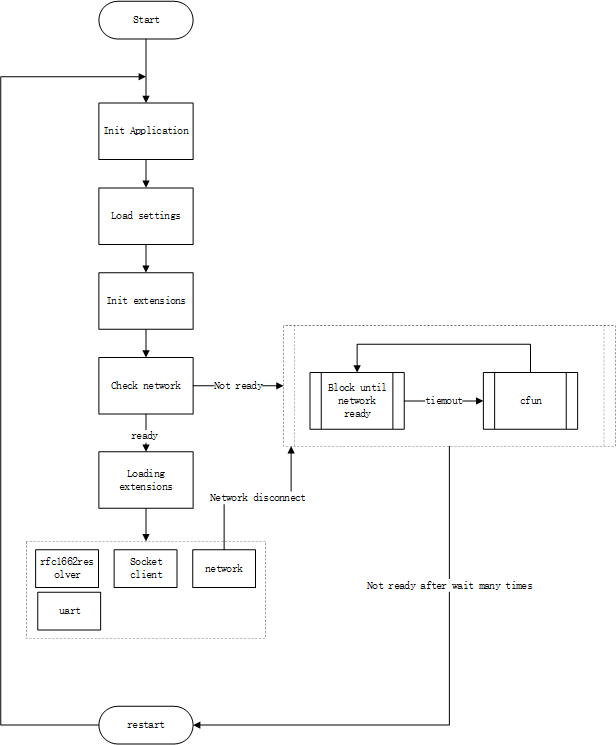

# Smart Electricity Meter Solution

[中文](README.zh.md) | English

## Overview

The smart electricity meter solution released by QuecPython includes serial communication modules, TCP clients, RFC1662 protocols, DLMS protocols (under development) and other common functional components in the electricity meter industry, and provides a basic application framework. Users can improve the application program development based on this framework.

## Application Framework 

### Introduction

The smart electricity meter solution is developed based on the application framework called `QFrame`.  

> `QFrame` is an application framework developed by QuecPython. [Click here](https://github.com/QuecPython/QFrame) to view the design and application guidance of this framework.

An application often relies on multiple business modules, and there may be coupling between business modules. 
The **star architecture design** is adopted for communication between business modules in framework design, as shown below:



Meditor in the figure is an intermediary object (usually named `Application`), and each business module communicates through the `Application` object. This design is called the **mediator pattern**.

Business modules are plugged into the application in the form of application extensions, and the interaction between business extensions is uniformly dispatched through the `Application` object.

### Application Object

Applications based on the `QFrame` framework must have a central object that schedules various business modules, namely the `Application` object mentioned above; application parameters are also configured through this object.

Sample code is as follows:

```python
from usr.qframe import Application

# init application instance  
app = Application(__name__)  

# read settings from json file
app.config.from_json('/usr/dev.json')

# app.config is a python dict, you can use to update settings as below:  
app.config.update(
    {
        "UART": {
            "port":2, 
            "baudrate":115200,
            "bytesize":8,
            "parity":0, 
            "stopbits":1,
            "flowctl":0 
        }
    }  
)
```

### Application Extensions

Application extensions refer to the business modules loaded by the `Application` object.

In general, application extensions get their own configurations from `app.config` and pass them to the application instance during initialization.  

The use of application extensions includes two parts: definition and initialization.  

#### Definition and initialization of application extensions  

Application extensions provide a base class called `AppExtensionABC`, defined as follows:  

```python  
class AppExtensionABC(object):
    """Abstract Application Extension Class"""

    def __init__(self, name, app=None): 
        self.name = name  # extension name
        if app:  
            self.init_app(app)  

    def init_app(self, app):
        # register into app, then, you can use `app.{extesion.name}` to get current extension instance  
        app.append_extesion(self)  
        raise NotImplementedError  

    def load(self):
        # loading extension functions, this method will be called in `app.mainloop` 
        raise NotImplementedError
```

The specific application extension class inherits this base class to constrain the interface definition of the application extension class.  

- We need to pass in the `Application` application object to the initialization method `__init__`. Call `init_app` when creating the application extension object to complete the initialization operation of the extension; you can also not pass in the application object, but directly create the application extension object, and then explicitly call `init_app` later to complete the initialization.
- The `load` method is called by the `Application` object and is used to load various application extensions.  

#### Using application extensions  

After the application extension inherits the base class `AppExtensionABC` and implements the necessary interface functions, refer to the following two code samples with different methods to load the application extension object.  

Method 1:  

```python
app = Application(__name__)  
ext = ExtensionClass(app)  
```

Method 2:   

```python   
ext = ExtensionClass()  
ext.init_app(app)  
```

## Application Development  

The code for the smart meter solution is hosted on [github](https://github.com/QuecPython/solution-electricity-meter.git). The directory structure is as follows:  

```
.  
|-- LICENSE  
|-- README.md   
|-- code  
|   |-- business.py  
|   |-- constant.py   
|   |-- demo.py  
|   |-- dev.json  
|   |-- protocol.py   
|   `-- qframe  
|       |-- __init__.py  
|       |-- builtins  
|       |   |-- __init__.py  
|       |   |-- clients.py  
|       |   |-- network.py   
|       |   `-- uart.py  
|       |-- collections.py  
|       |-- core.py  
|       |-- datetime.py  
|       |-- globals.py  
|       |-- led.py  
|       |-- logging.py  
|       |-- ota.py  
|       |-- qsocket.py  
|       |-- serial.py  
|       `-- threading.py  
`-- docs  
    `-- media  
        |-- UML.png  
        |-- init.png  
        |-- system.png  
        `-- ...
```

### Software Architecture Diagram  

The software architecture diagram for the smart electricity meter solution is as follows:  

  

### UML Class Diagram  

From the software architecture diagram above, we can see that the smart electricity meter solution includes DLMS, RFC1662, TCPClient and other application extensions. The logical relationship between the various application extensions in the application is shown in the following UML class diagram:  

   

### Software Initialization Process  

The initialization process of the smart electricity meter solution is as follows:   

  

1. Instantiate application object  
2. Import configuration json file  
3. Initialize application extension components (in this step each application extension is registered in the master application object to facilitate interaction between them)  
4. Check network (this step will block and wait for network ready, if timeout, try cfun switch to recover network)
5. Load application extensions and start related services (customizable implementation)
6. The system enters the normal running state (sim card and network detection are enabled by default. If network disconnection occurs, it will try cfun switch automatically to recover network)  

### Main Application  

As the script file for application entry, `demo.py` provides a factory function `create_app` that passes in the configuration path to initialize the application and load various application extensions.   

`demo.py` sample code is as follows:  

```python  
import checkNet  
from usr.qframe import Application  
from usr.business import rfc1662resolver, client, uart  

PROJECT_NAME = "QuecPython_Framework_DEMO"  
PROJECT_VERSION = "1.0.0"  


def poweron_print_once():
    checknet = checkNet.CheckNetwork(
        PROJECT_NAME,  
        PROJECT_VERSION,  
    )
    checknet.poweron_print_once()  


def create_app(name='DTU', config_path='/code/dev.json'):  
  # initialize Application  
  _app = Application(name)  
  # read settings from json file  
  _app.config.from_json(config_path)  

  # init rfc1662resolver extension  
  rfc1662resolver.init_app(_app)  
  # init uart extension  
  uart.init_app(_app)  
  # init tcp client extension  
  client.init_app(_app)  

  return _app  


# create app with `create_app` factory function  
app = create_app()  

if __name__ == '__main__':  
  poweron_print_once()  
  # loading all extensions  
  app.mainloop()  
```

### Application Extensions  

The main application extension functions include three main categories `rfc1662resolver` (1662 protocol resolution), `client` (tcp client) and `uart` (serial read and write), which are all registered in the application object ` Application` for ease of coordination.  

- `rfc1662resolver`: responsible for parsing and assembling RFC1662 protocol messages, (`RFC1662ProtocolResolver` instance object).  
- `client`: tcp client (`BusinessClient` instance object), responsible for communicating with the tcp server.  
- `uart`: serial port client (`UartBusiness` instance object), responsible for serial read and write.  

#### Class `RFC1662ProtocolResolver`

This class is an application extension class, an RFC1662 protocol data resolver, used to process RFC1662 protocol data transmitted in the business, and pack and unpack this class data.   

The class provides the following methods:  

- `resolve(msg)`
  - **Function**: Process an RFC1662 protocol message. The behavior is to find the processing function of the message from the registry by resolving the protocol (which can be understood as the message id of the protocol message), and call the function to process if found, otherwise throw a `ValueError` exception. See the `register` decorator function on how to register the processing function.  
  - **Parameters**: `msg` is an `RFC1662Protocol` object, which is an encapsulation class of the RFC1662 protocol, see the introduction below.  
  - **Return value**: None  
  - **Exceptions**: If the processing function cannot be found in the registry for the incoming `msg`, a `ValueError` exception will be thrown.   
- `register(protocol)` 
  - **Function**: It is a decorator function used to register a processing function for a protocol.
  - **Parameters**: `protocol` can be understood as the message id of the RFC1662 protocol. 
  - **Return value**: original function  
- `tcp_to_meter_packet(data)`
  - **Function**: Static method, pack the byte data `data` into a transparent RFC1662 data packet (0x2100), that is, the data frame passed to the meter by tcp transparent transmission. 
  - **Parameters**: `data`, byte type.  
  - **Return value**: 0x2100 protocol packet byte string  
  - **Exceptions**: None  
- `module_to_meter_packet(data)`
  - **Function**: Static method, assemble RFC1662 protocol data packet (0x2200), that is, the data frame sent by the module to the meter  
  - **Parameters**: data is a list, `[get/set, id, data]`, where:  
    - `get/set`: `COSEM.GET/COSEM.SET`, the corresponding values are `0xC0/0xC1` respectively  
    - `id`: function command word  
    - `data`: byte type  
  - **Return value**: 0x2200 protocol packet byte string   

Sample code:   

```python   
# we have inited a RFC1662ProtocolResolver object in `business.py` module  
# import `rfc1662resolver`   
from code.business import rfc1662resolver  


# decorate with protocol 0x2100  
@rfc1662resolver.register(0x2100)  
def handle2100(msg):  
  """when get a 0x2100 message,this function will be called"""  
  pass  
```

#### Class `RFC1662Protocol`

This class is a specific implementation of the RFC1662 protocol, including unpacking and packing. The instance object of this class is an encapsulated form of a complete RFC1662 protocol package. The main methods are:  

- `build_rfc_0x2100`: assemble 0x2100 protocol packet, return bytes, equivalent to `RFC1662ProtocolResolver.tcp_to_meter_packet` 
- `build_rfc_0x2200`: assemble 0x2200 protocol packet, return bytes, equivalent to `RFC1662ProtocolResolver.module_to_meter_packet`  
- `build`: class method, used to resolve a protocol packet frame, return `RFC1662Protocol` object.   
- `replay_get`: reply get command, judge success or failure  
- `replay_set`: reply set command  
- `reply_event`: reply event information   

#### TCP Client Component  

##### Base Class `TcpClient`  

This class exposes two interfaces to the user:   

- `recv_callback` method, users rewrite this method to achieve business processing of TCP server downlink data.  
- `send` method, users can call this method to send data to the server.   

Code is as follows:   

```python    
class TcpClient(object):
   	# ...   
    def recv_callback(self, data): 
        raise NotImplementedError('you must implement this method to handle data received by tcp.')  
    
    def send(self, data):
        # TODO: uplink data method  
        pass  
```

##### Subclass `BusinessClient`   

`BusinessClient` rewrites the `recv_callback` method to encapsulate the downlink data of the server into RFC1662 format messages and forwards the data to the serial port.   

Code is as follows:   

```python    
class BusinessClient(TcpClient):  
    
    def recv_callback(self, data):
        # recv tcp data and send to uart  
        data = RFC1662Protocol.build_rfc_0x2100(data)  
        CurrentApp().uart.write(data)  
```

#### Serial Communication Component  

##### Base Class `Uart`   

This class exposes two interfaces to users:   

- `recv_callback` method, users rewrite this method to achieve business processing of received serial data.   
- `send` method, users can call this method to send data to the serial port.   

Code is as follows:   

```python   
class Uart(object):
    # ...  
    def recv_callback(self, data):
        raise NotImplementedError('you must implement this method to handle data received from device.')  
    
    def write(self, data):
        # TODO: write data to uart  
        pass  
```

##### Subclass `UartBusiness`   

`UartBusiness` rewrites the `recv_callback` method to implement business processing of received serial data.  

```python    
class UartBusiness(Uart):  

        def recv_callback(self, data):
            # parse 1662 protocol data
            pass  
```

> In the subclass `UartBusiness`'s `recv_callback` method, after parsing the RFC1662 protocol message, constructing the message object, distribute the message processing business through the `rfc1662resolver.resolve` method.   

### Sequence Diagram of Component Interaction  


### Writing Business Programs   

Define a global `rfc1662resolver` resolver in the script file `business.py` to register message processing functions of specified types.   

The following sample code registers the 0x2100 protocol transparent transfer processing function:   

```python    
# >>>>>>>>>> handle rfc1662 message received from uart <<<<<<<<<<  

@rfc1662resolver.register(0x2100)  
def handle2100(msg):   
  """post data received to cloud"""
  # message body bytes  
  data = msg.info().request_data()  
  if data:   
    # post data to tcp server by `client` extension register in Application    
    CurrentApp().client.send(data)   
```
