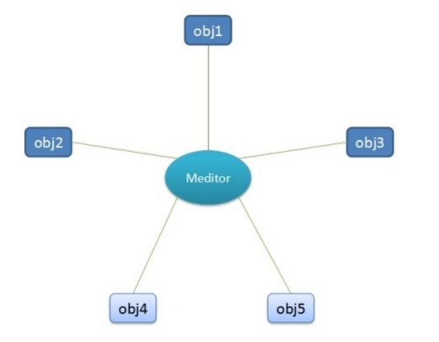
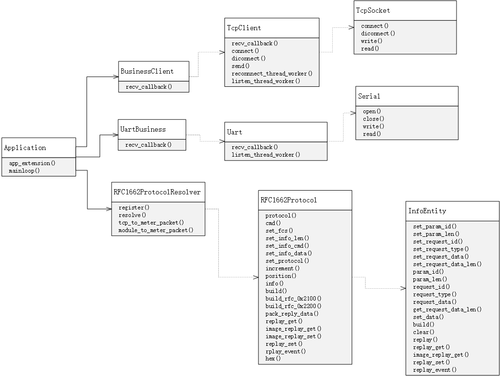
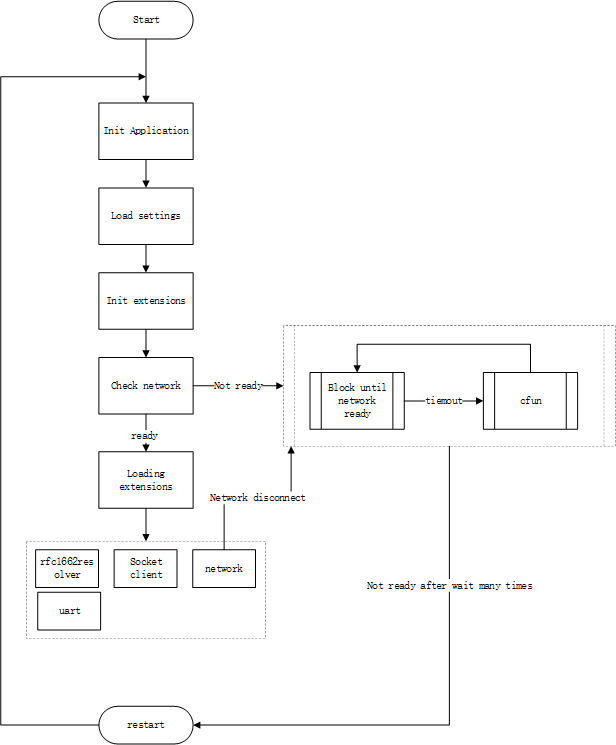
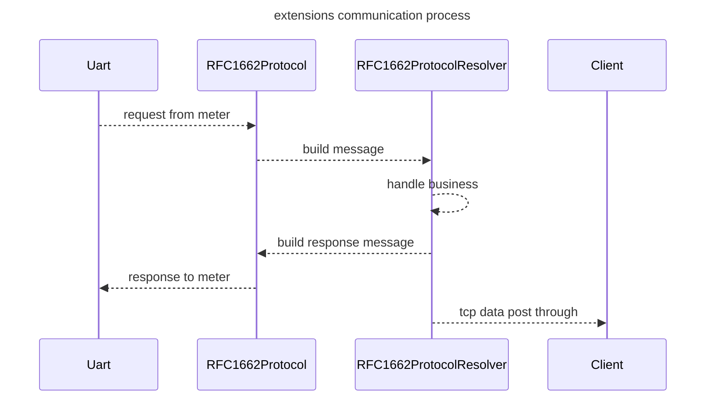

# 智能电表解决方案

中文 | [English](README.md)

## 概述

QuecPython 推出的智能电表解决方案包含了串口通信模块、TCP 客户端、RFC1662 协议、DLMS 协议（开发中）等电表行业常用功能组件，并提供了基础的应用框架，用户可基于该框架完善应用程序开发。

## 应用框架

### 简介

智能电表解决方案基于名为 `QFrame` 的应用框架开发而来。

> `QFrame` 应用框架是 QuecPython 开发的一个基础应用框架。[点此查看](https://github.com/QuecPython/QFrame)该框架的设计和应用指导。

一个应用程序往往会依赖多个业务模块，各业务模块之间可能存在耦合现象。
在框架设计中，业务模块之间通信是采用**星型结构设计**，如下图所示：



图中的 Meditor是一个中介对象（通常命名为 `Application`），各个业务模块之间通过 `Application` 对象通信，这种设计被称之为**中介模式**。

业务模块以应用拓展的形式安插在应用程序中，而各应用拓展之间的交互通过 `Application` 对象进行统一调度。

### 应用对象

基于 `QFrame` 框架的应用程序必须有一个调度各业务模块的的中心对象，即上文提到的 `Application` 对象；应用参数也是通过该对象配置。

示例代码如下：

```python
from usr.qframe import Application

# init application instance
app = Application(__name__)

# read settings from json file
app.config.from_json('/usr/dev.json')

# app.config is a python dict, you can use to update settings as below:
app.config.update(
    {
        "UART": {
            "port":2,
            "baudrate":115200,
            "bytesize":8,
            "parity":0,
            "stopbits":1,
            "flowctl":0
        }
    }
)
```

### 应用拓展

应用拓展指的是被 `Application` 对象加载的业务模块。

一般来说，应用拓展从 `app.config` 获取其自身的配置并在初始化时传递给应用实例。

应用拓展的使用包含定义和初始化两部分。

#### 应用拓展的定义与初始化

应用拓展提供一个名为 `AppExtensionABC` 的基类，定义如下：

```python
class AppExtensionABC(object):
    """Abstract Application Extension Class"""

    def __init__(self, name, app=None):
        self.name = name  # extension name
        if app:
            self.init_app(app)

    def init_app(self, app):
        # register into app, then, you can use `app.{extesion.name}` to get current extension instance
        app.append_extesion(self)
        raise NotImplementedError

    def load(self):
        # loading extension functions, this method will be called in `app.mainloop`
        raise NotImplementedError
```

该基类被具体的应用拓展类继承，用来约束应用拓展类的接口定义。

- 我们需要向初始化方法 `__init__` 传入 `Application` 应用程序对象。在创建应用拓展对象时调用 `init_app` 来完成拓展的初始化动作；亦可不传入应用对象，而直接创建应用拓展对象，后面再显性调用 `init_app` 来完成初始化。
- `load` 方法用来被 `Application` 对象调用，用于加载各应用拓展。

#### 应用拓展的使用

当应用拓展继承基类 `AppExtensionABC`，实现了必要的接口功能以后，可参照下面两种不同方式的代码，加载应用拓展对象。

方式一：

```python
app = Application(__name__)
ext = ExtensionClass(app)
```

方式二：

```python
ext = ExtensionClass()
ext.init_app(app)
```

## 应用程序开发

智能电表解决方案的代码托管于 [github](https://github.com/QuecPython/solution-electricity-meter.git)，代码的目录结构如下：

```PlainText
.
|-- LICENSE
|-- README.md
|-- code
|   |-- business.py
|   |-- constant.py
|   |-- demo.py
|   |-- dev.json
|   |-- protocol.py
|   `-- qframe
|       |-- __init__.py
|       |-- builtins
|       |   |-- __init__.py
|       |   |-- clients.py
|       |   |-- network.py
|       |   `-- uart.py
|       |-- collections.py
|       |-- core.py
|       |-- datetime.py
|       |-- globals.py
|       |-- led.py
|       |-- logging.py
|       |-- ota.py
|       |-- qsocket.py
|       |-- serial.py
|       `-- threading.py
`-- docs
    `-- media
        |-- UML.png
        |-- init.png
        |-- system.png
        `-- ...
```

### 软件框图

智能电表解决方案的软件框图如下：


### UML 类图

从上面软件框图，我们看到了智能电表解决方案包含了 DLMS、RFC1662、TCPClient 等应用拓展，各应用拓展在应用程序中的逻辑关系如下面的 UML 类图所示：



### 软件初始化流程

智能电表解决方案的初始化流程如下：



1. 实例化应用对象
2. 导入配置 json 文件
3. 初始化各应用拓展组件（此步骤会将各个应用拓展注册进主应用对象中，方便各拓展之间通信）
4. 检测网路（此步骤会阻塞等待网络就绪，若等待超时则尝试 cfun 切换以恢复网络）
5. 加载应用拓展，并启动相关服务（用户可自定义实现）
6. 系统进入正常运行状态（默认开启 sim 卡和网络检测，若出现掉网情况，会自行尝试 cfun 切换以恢复网络）

### 主应用程序

`demo.py` 作为应用程序入口的脚本文件，它提供工厂函数 `create_app`，向该函数传入配置路径来初始化应用程序和加载各应用拓展。

`demo.py` 示例代码如下：

```python
import checkNet
from usr.qframe import Application
from usr.business import rfc1662resolver, client, uart

PROJECT_NAME = "QuecPython_Framework_DEMO"
PROJECT_VERSION = "1.0.0"


def poweron_print_once():
    checknet = checkNet.CheckNetwork(
        PROJECT_NAME,
        PROJECT_VERSION,
    )
    checknet.poweron_print_once()


def create_app(name='DTU', config_path='/code/dev.json'):
  # initialize Application
  _app = Application(name)
  # read settings from json file
  _app.config.from_json(config_path)

  # init rfc1662resolver extension
  rfc1662resolver.init_app(_app)
  # init uart extension
  uart.init_app(_app)
  # init tcp client extension
  client.init_app(_app)

  return _app


# create app with `create_app` factory function
app = create_app()

if __name__ == '__main__':
  poweron_print_once()
  # loading all extensions
  app.mainloop()
```

### 应用拓展

主要应用拓展功能有三大类 `rfc1662resolver`（1662协议解析）、`client`（tcp 客户端）和 `uart`（串口读写），它们均被注册进应用对象 `Application` 中，方便互相协作。

- `rfc1662resolver`：负责解析和组装 RFC1662 协议报文，（`RFC1662ProtocolResolver` 实例对象）。
- `client`：tcp 客户端（`BusinessClient` 实例对象），负责与 tcp 服务器通信。
- `uart`：串口客户端（`UartBusiness` 实例对象），负责串口读写。

#### 类 `RFC1662ProtocolResolver`

该类是一个应用拓展类，是 RFC1662 协议数据的解析器，用于处理业务中传输的 RFC1662 协议数据，对该类数据进行解包组包的功能。 

该类提供如下方法：

- `resolve(msg)`
  - **功能**：处理一个 RFC1662 协议消息。行为是通过解析消息的 protocol（可以理解为协议报文的id），根据该 protocol 从注册表中查找该消息的处理函数，如果找到则调用函数处理，否则抛出 `ValueError` 异常。如何注册处理函数见装饰器函数 `register`。
  - **参数**：`msg` 是一个 `RFC1662Protocol` 对象，该类是 RFC1662 协议的封装类，见后续介绍。
  - **返回值**：None
  - **异常**：若传入 `msg` 未能在注册表中查找到处理函数，则抛出 `ValueError` 异常。
- `register(protocol)`
  - **功能**：是一个装饰器函数，用于注册一个 protocol 的处理函数。
  - **参数**：`protocol` 可以理解为 RFC1662 协议的报文 id。
  - **返回值**：原函数
- `tcp_to_meter_packet(data)`
  - **功能**：静态方法，将字节数据 `data`，组包成透传 RFC1662 数据包（0x2100），即 tcp 透传给表计的数据帧。
  - **参数**：`data`，字节类型。
  - **返回值**：0x2100 协议包字节串
  - **异常**：无
- `module_to_meter_packet(data)`
  - **功能**：静态方法，组 RFC1662 协议数据包（0x2200），即模块主动发向表计的数据帧
  - **参数**：data 是一个列表，`[get/set, id, data]`，其中：
    - `get/set`：`COSEM.GET/COSEM.SET`，分别对应值为 `0xC0/0xC1`
    - `id`：功能命令字
    - `data`：字节类型
  - **返回值**：0x2200 协议包字节串

示例代码如下：

```python
# we have inited a RFC1662ProtocolResolver object in `business.py` module
# import `rfc1662resolver`
from code.business import rfc1662resolver


# decorate with protocol 0x2100
@rfc1662resolver.register(0x2100)
def handle2100(msg):
  """when get a 0x2100 message，this function will be called"""
  pass
```

#### 类 `RFC1662Protocol`

该类是 RFC1662 协议的具体实现，包括解包和组包。该类对象是一个完整 RFC1662 协议包的封装形式。主要方法有：

- `build_rfc_0x2100`：组 0x2100 协议包，返回字节，等同于 `RFC1662ProtocolResolver.tcp_to_meter_packet`
- `build_rfc_0x2200`：组 0x2200 协议包，返回字节，等同于 `RFC1662ProtocolResolver.module_to_meter_packet`
- `build`：类方法，用于解析一帧协议包，返回 `RFC1662Protocol` 对象。
- `replay_get`：应答 get 指令, 判断成功失败
- `replay_set`：应答 set 指令
- `reply_event`：应答 event 信息

#### TCP 客户端组件

##### 基类 `TcpClient`

该类向用户开放了两个接口：

- `recv_callback` 方法，用户通过重写该方法，实现对 tcp 服务器下行数据的业务处理。
- `send` 方法，用户可调用该方法发送数据至服务器。

代码如下：

```python
class TcpClient(object):
   	# ...
    def recv_callback(self, data):
        raise NotImplementedError('you must implement this method to handle data received by tcp.')
    
    def send(self, data):
        # TODO: uplink data method
        pass
```

##### 子类 `BusinessClient`

`BusinessClient` 通过重写 `recv_callback` 方法，实现将服务器下行数据打包为 RFC1662 格式的报文，并将数据转发至串口。

代码如下：

```python
class BusinessClient(TcpClient):
    
    def recv_callback(self, data):
        # recv tcp data and send to uart
        data = RFC1662Protocol.build_rfc_0x2100(data)
        CurrentApp().uart.write(data)
```

#### 串口通信组件

##### 基类 `Uart`

该类向用户开放了两个接口：

- `recv_callback` 方法，用户通过重写该方法，实现对接收到的串口数据的业务处理。
- `send` 方法，用户可调用该方法向串口发送数据。

代码如下：

```python
class Uart(object):
    # ...
    def recv_callback(self, data):
        raise NotImplementedError('you must implement this method to handle data received from device.')
    
    def write(self, data):
        # TODO: write data to uart
        pass
```

##### 子类 `UartBusiness`

`UartBusiness` 通过重写 `recv_callback` 方法，实现对接收到的串口数据的业务处理。

```python
class UartBusiness(Uart):

        def recv_callback(self, data):
            # parse 1662 protocol data
            pass
```

> 在子类 `UartBusiness` 的 `recv_callback` 方法中解析 RFC1662 协议报文，构建消息对象后，通过`rfc1662resolver.resolve` 方法分发消息处理业务。

### 组件交互时序图



### 编写业务程序

在脚本文件 `business.py` 中定义一个全局的 `rfc1662resolver` 解析器，用于注册指定类型的消息处理函数。

如下示例代码注册 0x2100 协议透传处理函数：

```python
# >>>>>>>>>> handle rfc1662 message received from uart <<<<<<<<<<

@rfc1662resolver.register(0x2100)
def handle2100(msg):
  """post data received to cloud"""
  # message body bytes
  data = msg.info().request_data()
  if data:
    # post data to tcp server by `client` extension register in Application
    CurrentApp().client.send(data)
```
